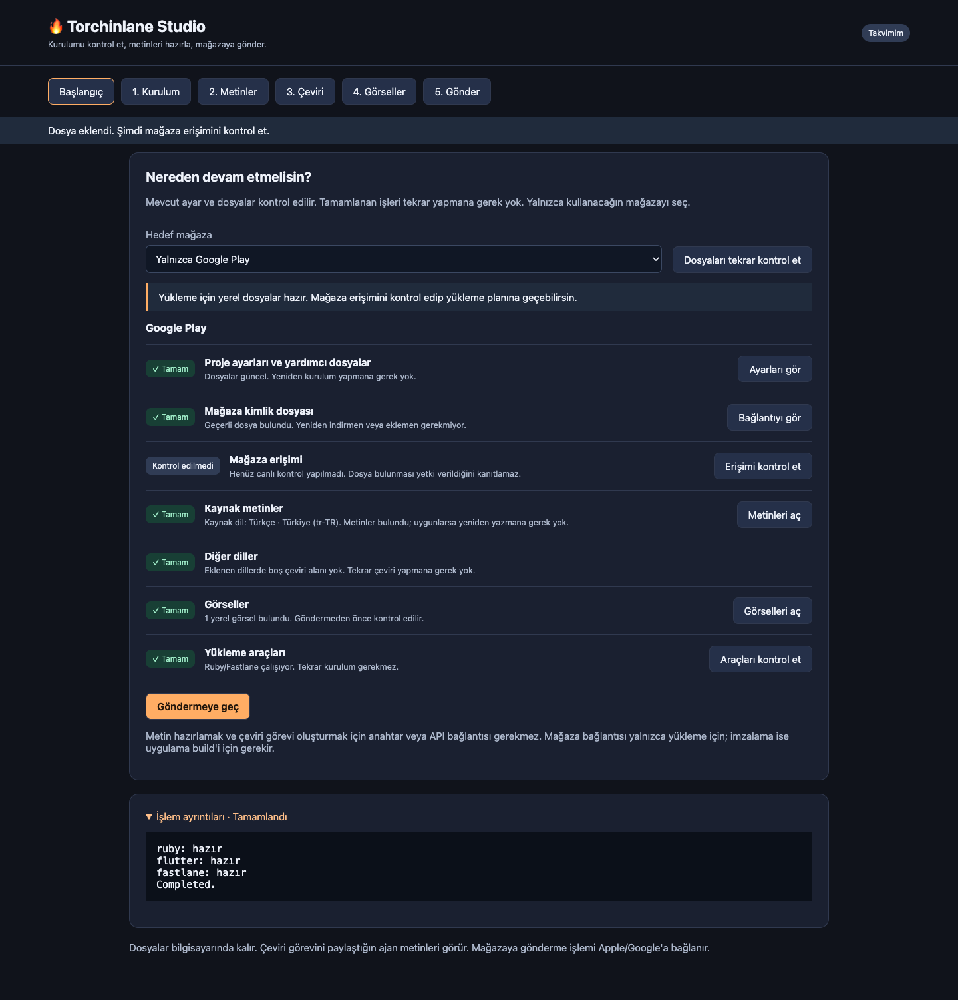

# torchinlane

A global Dart CLI and local browser GUI for Flutter releases. Build and upload
apps, manage localized App Store/Google Play texts and images, translate release
notes, import credentials, configure signing, and generate GitHub Actions CI.

Torchinlane runs **outside** your Flutter application. No widget, runtime SDK,
Node.js installation, or hosted service is needed for Studio.

## Install and upgrade

Requirements: Dart `^3.5.0`, a Flutter project with `pubspec.yaml`, `ios/` and
`android/`, Ruby/Fastlane, and macOS/Xcode for iOS builds. Use a current Fastlane
release; newer Apple locales and Google OAuth credential support depend on it.
CocoaPods is required for iOS plugins. `doctor --fix` installs/repairs the gems.

```bash
dart pub global activate torchinlane
# Add ~/.pub-cache/bin to your PATH if needed.
```

For development or a local checkout:

```bash
dart pub global activate --source path /path/to/torchinlane
```

**Upgrade the CLI and update each previously initialized Flutter project.**
Upgrading the package alone does not regenerate existing Fastfiles.

```bash
dart pub global activate torchinlane
cd /path/to/flutter_app
torchinlane update --dry-run
torchinlane update -y
```

`update` backs up changed generated files as `.bak` and preserves your config,
store content, release notes and ExportOptions. New generated helpers are
`fastlane/StoreHelper.rb` and `fastlane/locales.json`; do not edit the registry
in generated Ruby. See [migration](doc/migration.md).

## Start with the GUI

Run inside your Flutter project:

```bash
torchinlane studio
```

Studio opens an authenticated, loopback-only local panel. Keep the terminal
open; Ctrl+C stops it. `--no-open` prints the URL, and `--port 8787` selects a
port. Copy the complete URL, including its session fragment, when opening a
second browser tab.

Studio now opens a **readiness overview** in Turkish. Select App Store, Google
Play, or both. It detects existing files and tells you which steps are complete,
which checks have not run, and what can be skipped. No setup is repeated merely
because you opened the panel.

1. **Kurulum (setup):** existing values are loaded. Save only changed/missing
   settings. Valid credential files are recognized; import controls collapse
   when a file is present. Live access is a separate check, remembered for this
   server session and invalidated when credentials/app identity change.
2. **Metinler (texts):** open the configured source language and write app texts
   and release notes. Common fields can be copied from the other store into
   empty fields. Existing texts can be left alone. Advanced fields are collapsed.
3. **Çeviri (translation):** add target languages, click **Çeviri görevini hazırla**,
   then **Görevi kopyala**. Paste into Claude Code/Codex working in the Flutter
   project. When finished, click **Sonuçları yükle ve kontrol et**. Counts show
   missing fields; completed translations can be skipped. No translation API key
   is required. Paid API and overwrite options remain under advanced details.
4. **Görseller (images):** add files per language/device, only if replacing or
   adding images. Existing remote images do not need to be re-imported.
5. **Gönder (upload):** the default is app metadata only. Check the upload plan,
   then send content. Google version/track fields appear when notes are selected.
   Building/uploading a new app binary is a separate collapsed section.

Read the [Turkish step-by-step quick start](doc/quick-start.tr.md). You can prepare
content without store credentials, Ruby/Fastlane, or native signing. Before
upload, check account access and tools in Setup. Imzalama (signing) matters for
new app builds, not metadata-only upload. Tool checks do not install anything;
repair is an explicit action. Existing signing files are only evidence of setup,
not proof that a release build will succeed. Optional API translation requires
`ANTHROPIC_API_KEY`; it is not part of the default translation workflow.

Studio never sends credentials to a hosted Torchinlane backend. Credentials
remain on the local machine. Agent tasks are generated locally; you choose
which coding agent receives the metadata. Optional API translation sends text to Anthropic;
store operations connect to Apple/Google. The local panel blocks foreign
origins and concurrent edits while a job runs.



## Initialize from terminal or CI

```bash
torchinlane init                     # interactive setup + tool checks
torchinlane init --skip-tools        # scaffold without installing gems
torchinlane init --config /path/to/prepared.yaml --skip-tools
```

The `--config` form avoids stdin prompts and keeps all supplied configuration.
`--force` allows replacing an existing initialization. Store content and existing
ExportOptions are preserved. You can use Studio before `init` to complete setup.

## Localized texts and images

```bash
torchinlane store locales --platform ios,android
torchinlane store init --locales en,tr,de,pt-PT,zh-Hant
torchinlane store init --locales all   # explicitly opt into all store locales
```

Files use **native store locale codes**, with separate platform content:

```text
store/
  ios/
    en-US.json
    tr.json
    images/tr/iphone/01-home.png
    images/tr/ipad/01-home.png
  android/
    en-US.json
    tr-TR.json
    images/tr-TR/phoneScreenshots/01-home.png
    images/tr-TR/featureGraphic/banner.png
    images/tr-TR/icon/icon.png
```

Example Google text file:

```json
{
  "title": "My App",
  "short_description": "Plan your day with ease.",
  "full_description": "A longer description of the app's actual features.",
  "release_notes": "Improved reminders and fixed calendar issues."
}
```

Apple fields: `name`, `subtitle`, `description`, `keywords`,
`promotional_text`, `support_url`, `marketing_url`, `privacy_url`,
`release_notes`. Google fields: `title`, `short_description`,
`full_description`, `video`, `release_notes`.

**Blank fields are omitted from uploads**, preserving existing remote text.
Long text is rejected instead of truncated. Images are checked for format,
dimensions, transparency and count. These checks do not replace store review
or all device-specific promotional eligibility rules.

```bash
# Print a task to paste into Claude Code/Codex (no API request):
torchinlane store translate --from en --locales tr,de,pt-PT
# Same task; without --locales, use locales already added under store/:
torchinlane store prompt --from en
# Optional direct API translation, potentially separately billed:
torchinlane store translate --api --from en --locales tr,de,pt-PT
torchinlane store validate
torchinlane store export --output build/store-export
torchinlane store push --scope metadata --dry-run
torchinlane store push --scope metadata
torchinlane store push --scope images --platform ios,android
torchinlane store push --scope notes --track production --version-code 42 --app-version 1.2.0
torchinlane store push --version-code 42 --app-version 1.2.0
```

`--scope` is `all` (default), `metadata`, `images` or `notes`. Google note-only
updates require an existing `--version-code` on the chosen `--track`; supplied
notes are merged with existing locales and release status is preserved.
Apple changes target an editable version; `--app-version` selects its version
string. Store uploads do not upload binaries, submit Apple review or change
Google rollout status.

Google synchronizes each supplied screenshot group; omitted groups are
preserved. Apple adds screenshots by default. **`--replace-images` clears all
existing screenshot device sets for supplied Apple locales**, then uploads the
local set. Include every device set you want to retain for those locales.

```bash
torchinlane store pull                         # save snapshot and report differing fields
torchinlane store pull --platform ios --app-version 1.2.0
torchinlane store pull --apply                 # import remote text with .bak backups
```

Pull downloads text metadata, not screenshot files. Apple notes are included;
Google pull downloads listing text, not track-specific release notes. Snapshots
are stored in gitignored `store/.snapshots/`. See [store content reference](doc/store-content.md)
for image groups, locale policy, field limits and first-release prerequisites.

## Credentials and signing

```bash
torchinlane credentials import --platform ios --file /path/AuthKey_KEYID.p8
torchinlane credentials import --platform android --file /path/google.json
torchinlane credentials verify --platform ios,android
torchinlane doctor --platform android --verify-credentials
```

Use `--profile company` on import to store a reusable credential outside the
project, at `~/.torchinlane/credentials/company/`. The config records its absolute
path; use a different profile name to rotate a key. Existing different keys are
not silently overwritten. Do not commit a machine-specific config path if other
machines should use the default; CI can override credential paths.

Environment overrides: `ASC_KEY_PATH`, `ASC_KEY_ID`, `ASC_ISSUER_ID` and
`GOOGLE_APPLICATION_CREDENTIALS`. Google service account and external-account
(WIF) JSON are supported. OAuth `authorized_user` JSON needs a current Fastlane
version with that credential type; Torchinlane does not create an OAuth client
or consent screen for you.

Google Cloud bootstrap uses your existing `gcloud` login and permissions:

```bash
gcloud auth login
torchinlane credentials bootstrap-google --project-id my-cloud-project --dry-run
torchinlane credentials bootstrap-google --project-id my-cloud-project --create-key
# Keyless GitHub CI:
torchinlane credentials bootstrap-google --project-id my-cloud-project --repository OWNER/REPO
```

It enables APIs, creates/reuses a service account and optionally imports a JSON
key or creates repository-restricted WIF. You still grant the service account
app/release permissions in Play Console. The Cloud project must already exist.
Apple API access and the initial `.p8` download remain account-owner/admin steps.

An Apple `.p8` is not a signing certificate. Automate certificate/profile setup
with an encrypted private `match` repository:

```bash
export MATCH_PASSWORD='your repository encryption password'
torchinlane signing sync --git-url git@github.com:company/ios-certificates.git --write
# Later machines/CI install existing identities without changing the repository:
torchinlane signing sync --git-url git@github.com:company/ios-certificates.git
```

This installs profiles, configures Release/Profile signing in Runner.xcodeproj
and updates ExportOptions to manual signing with the installed profile. Local
project/export files receive `.bak` backups. Requires macOS, private repository
access, appropriate Apple API permissions and a valid developer membership.
Custom targets/flavors need their own signing configuration.

For Android, reuse the app's existing upload keystore:

```bash
export KEYSTORE_PASSWORD='...'
export KEY_PASSWORD='...'
torchinlane signing android --keystore /path/upload-keystore.jks --alias upload
```

This copies the keystore to gitignored `.torchinlane/`, writes protected
`android/key.properties`, and replaces the stock Flutter debug-signing
placeholder in Groovy/Kotlin Gradle with release signing. Existing custom
signing blocks are preserved; unsupported layouts produce an actionable error.
The command imports an existing key; it does not create/replace a published
app's signing identity. Passwords are read from environment variables, not CLI
arguments. More: [automation and signing](doc/automation.md).

## Build and deploy

```bash
torchinlane deploy --platform ios,android --target internal
torchinlane deploy --platform ios,android --target production --with-store
torchinlane deploy --platform android --upload-only --with-store
torchinlane deploy --dry-run --with-store
```

Live app access is checked before building (skip with `--skip-credential-check`
when CI already verified it). Android/iOS run independently; failures are reported per platform. `--with-store`
validates local store content before building and uploads it after binary
uploads. The Flutter `pubspec.yaml` version selects the Apple version and Google
version code. Store JSON notes, when supplied, override legacy changelog notes
for the same release. `--skip-release-notes` skips both sources of release notes.

| Flag | Behavior |
| --- | --- |
| `--platform` | `ios`, `android`, or `ios,android` |
| `--target` | `internal` (default) or `production` |
| `--upload-only` | Reuse existing AAB/IPA |
| `--skip-clean` | Skip Flutter clean/pub get |
| `--skip-credential-check` | Skip the automatic pre-build live app-access check |
| `--deep-clean` | Remove native build caches before building |
| `--skip-release-notes` | Upload without release notes |
| `--with-store` | Upload saved store content after binaries |
| `--release-status` | Google `draft` (default), `completed`, or `inProgress` |
| `--rollout` | Fraction between 0 and 1, required with `inProgress` |
| `--dry-run` | Print/validate commands without uploading/building |

**Draft Google builds are not served to testers or users.** For an automated
internal release or production rollout, explicitly select the serving status:

```bash
torchinlane deploy --platform android --target internal --release-status completed
torchinlane deploy --platform android --target production --release-status inProgress --rollout 0.1
```

Google reviews/account restrictions can still apply. Apple production uploads
remain unsubmitted (`submit_for_review: false`, `automatic_release: false`);
submit the final version through App Store Connect. TestFlight uploads attach
localized What to Test text and wait for processing when notes are supplied
(up to 30 minutes); tester assignment and external beta review remain Apple
requirements.

The generated `sh scripts/build.sh` remains available for terminal-guided
build/version/release-note prompts. Release notes are retained after successful
upload for audit and retry; use `changelog clear` explicitly to remove them.

## Generate GitHub Actions

```bash
torchinlane ci init --platform android
torchinlane ci init --platform ios,android \
  --wif-provider projects/123/locations/global/workloadIdentityPools/torchinlane-github/providers/github-ID \
  --service-account torchinlane@my-cloud-project.iam.gserviceaccount.com \
  --signing-git-url git@github.com:company/ios-certificates.git
```

Generates `.github/workflows/torchinlane.yml` with manual dispatch, independent
platform jobs, tool setup, credential restoration, signing, app-access checks
and optional store upload. The package version is pinned to the installed CLI
version for reproducible activation. Local development versions must be published
first or use a private/local source installation. Use `--flutter-version` to pin Flutter;
`stable` is the default. Existing workflows need `--force` and receive backups.
Set up secrets as described in [automation](doc/automation.md). The generated
iOS job deliberately requires a signing repository or your own signing step.

## Existing commands

```bash
torchinlane bump patch               # major/minor/patch/build
torchinlane changelog translate --from en
torchinlane changelog push --platform android --track production --version-code 42
torchinlane changelog push --platform ios --app-version 1.2.0
torchinlane changelog clear
torchinlane screenshots capture --platform ios --locale tr
torchinlane screenshots prompts
torchinlane doctor --fix
torchinlane uninstall --yes
```

Legacy notes live at `changelogs/<locale>/release_notes.txt`. The default 32
source locales remain for compatibility; configure more native/alias locales
in `torchinlane.yaml`. A locale unsupported by a store is reported and skipped.
Duplicate source folders mapping to the same store locale fail explicitly.
Google/Apple notes have separate 500/4000 character validation.

Screenshot capture is interactive and captures the **current app screen**;
`--locale` labels the output, it does not switch the app's language. Android
capture now reads binary PNG output correctly. Prompts produce Markdown, not
finished artwork. Fully automatic navigation/capture requires app-specific
integration/UI tests and is not generated by this package.

Only optional `store translate --api`, legacy `changelog translate` and AI
screenshot prompts use `ANTHROPIC_API_KEY` and the configurable
`TORCHINLANE_AI_MODEL` (default `claude-sonnet-4-6`). Translation outputs are
checked for complete fields and character limits. Failed translations do not
write invalid content. Translation is optional; manually authored content
requires no AI key. Agent task generation also requires no AI key or network.
Agent usage follows the chosen tool’s own subscription and limits.

`uninstall` removes the generated Fastlane/config/build wrapper/ExportOptions;
`changelogs/`, `store/`, signing files and generated CI workflows remain yours.

## Configuration

```yaml
app_name: "My App"
ios:
  bundle_id: "com.example.app"
  team_id: "ABCDE12345"
  itc_team_id: "123456789" # optional, defaults to team_id
  apple_id: "dev@example.com"
  asc_key_id: "KEYID"
  asc_issuer_id: "issuer-uuid" # empty for individual API keys
  asc_key_path: "ios/fastlane/api_key.p8"
  firebase_crashlytics: false
  firebase_app_id: ""
android:
  package_name: "com.example.app"
  service_account_json: "android/fastlane/fastlane-service-account.json"
  firebase_app_id: ""
changelogs:
  dir: "changelogs"
  source_locale: "en"
  locales: [en, tr, de, en-GB, pt-PT, zh-Hant]
build:
  obfuscate: true
  split_debug_info: "build/debug-info"
```

Config contains IDs and paths, not key contents. Strings are quoted on render
to preserve names containing colons and numeric-looking IDs. Credential paths
are honored by all generated lanes; CI environment overrides take precedence.
`screenshots` settings in older configs are reserved; current capture uses the
`screenshots/` directory and connected/booted devices.

## Verification

```bash
dart analyze
dart test
```

Tests cover locales, partial-content preservation, Unicode limits, image
validation, translation failures, credentials, signing/CI generation, GUI HTTP
flows, and generated Ruby/shell behavior. They do not perform authenticated
live store uploads. See [implementation report](doc/implementation-report.tr.md).

MIT license.
